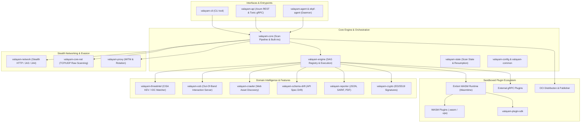

# Valayam Architecture

Valayam is an enterprise-grade, high-performance modular vulnerability scanner built in Rust. It utilizes a layered, decoupled vertical slice architecture with sandboxed WebAssembly (WASM) plugin execution, gRPC distribution, and advanced network evasion.

---

## 1. System Architecture Diagram

---

## 2. Layer Breakdown

### Layer 1: Core Framework & Execution Pipeline
- **`valayam-core`**: The central orchestrator that coordinates templates, native plugins (HTTP, schema drift, DNS audit, port scan, threat intel, OOB, shells), and distribution.
- **`valayam-engine`**: High-performance execution engine featuring:
  - **Topological Plugin DAG**: Dependency-ordered plugin execution with cycle detection.
  - **Extism WASM Runtime**: Sandboxed WebAssembly execution with host function callbacks (DNS resolution, state key-value store, host HTTP).
  - **gRPC Plugin Bridges**: Remote plugin execution over Tonic gRPC.
  - **Token Bucket Rate Limiting**: Global and per-target request throttling with adaptive backoff.
  - **Matcher & Extractor Engine**: Regex, status code, word, and header pattern matching with dynamic variable extraction.
- **`valayam-common`**: Shared utilities across crates (common port lists, secret detection regexes, URL normalization, User-Agent rotator).
- **`valayam-models`**: Strict data models (`VulnerabilityTemplate`, `Finding`, `WasmInput`, `WasmOutput`).
- **`valayam-error`**: Unified scanner and network error hierarchy.
- **`valayam-config`**: Environment and file-based configuration loading.

### Layer 2: Networking, Stealth & Evasion
- **`valayam-network`**: High-performance HTTP client engine supporting:
  - JA3 / JA4 TLS fingerprint spoofing to bypass WAFs.
  - User-Agent pool rotation.
  - HTTP/SOCKS proxy rotation and connection pooling.
- **`valayam-core-net`**: Raw TCP/UDP port scanning and network probing.
- **`valayam-proxy`**: Built-in MITM proxy for capturing browser/API traffic and auto-generating vulnerability templates.

### Layer 3: Security Modules & Intelligence
- **`valayam-threatintel`**: Integration with CISA Known Exploited Vulnerabilities (KEV) and local/remote IOC matching engines.
- **`valayam-oob`**: Out-of-band correlation and interaction server for blind vulnerabilities (SSRF, RCE, blind SQLi).
- **`valayam-crawler`**: Async web crawler for discovering endpoints and parameters before scanning.
- **`valayam-schema-drift`**: Automatic API schema drift detection comparing live responses against OpenAPI/Swagger specifications.
- **`valayam-reporter`**: Multi-sink reporting system supporting JSON, SARIF (for GitHub CodeQL integration), and PDF exports.
- **`valayam-crypto`**: ED25519 cryptographic key generation, signature generation, and verification for plugin integrity.

### Layer 4: Plugin Ecosystem
- **`valayam-plugin-sdk`**: Rust SDK for building WASM and gRPC plugins.
- **`.vpa` Packaging**: Packaged plugin archive containing WASM binary, metadata, and ED25519 signature.
- **OCI Distribution**: Push and pull plugins directly from OCI-compliant container registries.

### Layer 5: Interfaces & Distribution
- **`valayam-cli`**: Command-line interface with interactive progress, batch scanning, subcommands, and live control.
- **`valayam-api`**: High-throughput REST and gRPC API control plane (Axum web server & Tonic gRPC service) for orchestration.
- **`valayam-agent` & `valayam-ebpf-agent`**: Daemon agents for continuous host/network scanning with Linux eBPF kernel-level event hooks.
- **`valayam-tests`**: Integration testing suite with mock HTTP servers for validating complete scanning pipelines.

---

## 3. Execution Data Flow

1. **Target Ingestion & Pre-flight**:
   - The CLI or API receives a target URL/IP.
   - Optional crawler discovers endpoints; WAF detection fingerprints defenses.
2. **Template & Plugin Resolution**:
   - Templates (Native YAML or Nuclei YAML) are loaded from filesystem or OCI registry.
   - Plugins are verified against cryptographic signatures if enforced.
   - Plugin dependency graph is resolved via topological sorting.
3. **Execution & Sandboxing**:
   - `valayam-engine` dispatches requests through rate-limited workers.
   - WASM plugins run in isolated sandboxes with strictly defined host access rules.
4. **Matching & Findings Aggregation**:
   - Responses are evaluated by the Matcher engine.
   - Dynamic variables are extracted and fed into subsequent requests.
   - Out-of-band correlations are polled from `valayam-oob`.
5. **Reporting**:
   - Findings are normalized and emitted to configured sinks (Console, JSON, SARIF, PDF).
