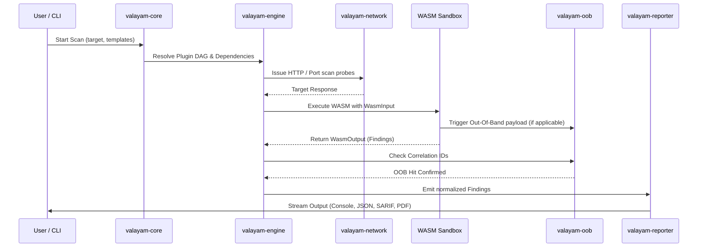

# Valayam Architecture Specification

Valayam is an enterprise-grade vulnerability scanning and continuous security assessment platform written in Rust. It utilizes a modular, decoupled workspace architecture combining high-performance native components, sandboxed WebAssembly (WASM) plugins, out-of-process gRPC workers, and kernel-level eBPF telemetry hooks.

---

## 1. Workspace Directory & Crate Layout

```
valayam/
├── Cargo.toml                         # Virtual workspace configuration
├── ARCHITECTURE.md                    # Top-level architecture overview
├── README.md                          # Project documentation
├── helper.md                          # CLI & operations guide
│
├── crates/
│   ├── valayam-core/                  # Central scanning orchestrator & native plugin definitions
│   ├── valayam-engine/                # Execution DAG, Extism WASM runtime, rate limiter & matchers
│   ├── valayam-cli/                   # Command-line interface with interactive progress
│   ├── valayam-api/                   # Axum REST & Tonic gRPC control plane service
│   ├── valayam-agent/                 # Continuous auditing daemon
│   ├── valayam-ebpf-agent/            # Linux eBPF kernel-level event monitoring agent
│   ├── valayam-network/               # Stealth HTTP client, JA3/JA4 spoofing, proxy manager
│   ├── valayam-core-net/              # Raw TCP/UDP port scanning and network probing
│   ├── valayam-common/                # Shared utilities (ports, secrets regex, URL parser, UA rotator)
│   ├── valayam-models/                # Strictly typed schema definitions (templates, findings, I/O)
│   ├── valayam-threatintel/           # CISA KEV feeds, IOC matcher, offline vulnerability DB
│   ├── valayam-oob/                   # Out-of-band correlation and interaction server
│   ├── valayam-crawler/               # Target endpoint and asset discovery crawler
│   ├── valayam-schema-drift/          # Live API vs. OpenAPI schema drift analyzer
│   ├── valayam-reporter/              # Multi-sink reporting engine (JSON, SARIF, PDF, console)
│   ├── valayam-proxy/                 # MITM proxy for traffic capture and template generation
│   ├── valayam-crypto/                # ED25519 key generation & plugin signature verification
│   ├── valayam-plugin-sdk/            # Rust SDK for authoring WASM & gRPC plugins
│   ├── valayam-config/                # Configuration management and environment loading
│   ├── valayam-error/                 # Unified error hierarchy
│   ├── valayam-proto/                 # Protocol Buffers & Tonic gRPC definitions
│   ├── valayam-telemetry/             # OpenTelemetry metrics and tracing instrumentation
│   ├── valayam-state/                 # In-memory and persistent scan state store
│   ├── valayam-payloads/              # Standard security payloads and fuzzing wordlists
│   └── valayam-tests/                 # End-to-end integration and mock server test suite
│
├── plugins-wasm/                      # Standalone WASM security plugins (e.g. cors-audit)
├── templates_repo/                    # YAML vulnerability templates
└── docs/                              # Technical guides, ADRs, and plugin specifications
```

---

## 2. Core Architectural Pillars

### 1. Extensible Plugin DAG Execution (`valayam-engine`)
The scan execution engine schedules plugins using a topological dependency graph:
- **Topological Sorting**: Resolves plugin execution order and enforces prerequisite outputs.
- **WASM Isolation**: WASM modules execute inside sandboxed `wasmtime`/`extism` runtimes with enforced memory limits and timeout guards.
- **Host Functions**: WASM plugins interact with the outside world only through controlled host functions (`dns_resolve`, `kv_get`, `kv_set`, `host_http_get`).
- **Cryptographic Trust**: Enforces ED25519 signature checks before loading any third-party `.vpa` package or `.wasm` binary.

### 2. Stealth Networking & Evasion (`valayam-network` & `valayam-core-net`)
Built to operate transparently across restrictive network environments:
- **JA3 / JA4 Fingerprint Spoofing**: Simulates realistic browser TLS handshakes (Chrome, Firefox, Safari) using custom `rustls` configurations.
- **Dynamic Proxy Rotation**: Pools and cycles SOCKS5 and HTTP proxies per request.
- **User-Agent Randomization**: Randomized header generation via `valayam-common::UserAgentRotator`.
- **Token Bucket Rate Limiting**: Centralized rate limiting via `governor` prevents accidental self-denial-of-service.

### 3. Distributed Operations & Control Plane (`valayam-api` & `valayam-agent`)
- **API Server**: `valayam-api` exposes REST and gRPC endpoints for initiating scans, pausing/resuming jobs, and collecting findings.
- **Worker Daemon**: Remote worker nodes execute scans offloaded from CLI or orchestrator.
- **eBPF Monitoring**: `valayam-ebpf-agent` attaches to Linux kernel tracepoints to observe network connections and socket activities directly.

### 4. Domain Security Modules
- **`valayam-threatintel`**: Continually synchronizes CISA KEV feeds and matches against live scan targets.
- **`valayam-oob`**: Runs a lightweight DNS/HTTP server generating correlation IDs to detect blind SSRF, RCE, and out-of-band leaks.
- **`valayam-schema-drift`**: Validates dynamic API responses against OpenAPI/Swagger schemas to pinpoint undocumented routes and breaking changes.
- **`valayam-crawler`**: Crawls web targets, parses HTML/JS, extracts form endpoints, and passes targets into the scan pipeline.

---

## 3. Findings & Data Flow


